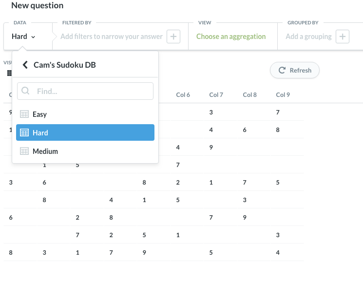

# Sample Metabase Driver: Sudoku



All you need you do is drop the driver in your `/path/to/metabase/plugins/` directory.

## Building the driver

## Prereq: Install the Clojure CLI

Make sure you have the `clojure` CLI version `1.10.3.933` or newer installed; you can check this with `clojure
--version`. Follow the instructions at https://clojure.org/guides/getting_started if you need to install a
newer version.

## Prereq: Clone the Metabase core repo

```sh
git clone https://github.com/metabase/metabase
```

## Build it (Updated for build script changes in Metabase 0.46.0)

Unfortunately the current command for building a driver is quite a mouthful, but we needed to make changes to how the
Metabase build script works to avoid issues with dependencies shadowing one another. Please upvote
https://ask.clojure.org/index.php/7843/allow-specifying-aliases-coordinates-that-point-projects , which will allow us
to make building drivers much more convenient in the future!

```sh
# Example for building the driver with bash or similar

# switch to the local checkout of the Metabase repo
cd /path/to/metabase/repo

# get absolute path to the driver project directory
DRIVER_PATH=`readlink -f ~/sudoku-driver`

# Build driver. See explanation below
clojure \
  -Sdeps "{:aliases {:sudoku {:extra-deps {com.metabase/sudoku-driver {:local/root \"$DRIVER_PATH\"}}}}}"  \
  -X:build:sudoku \
  build-drivers.build-driver/build-driver! \
  "{:driver :sudoku, :project-dir \"$DRIVER_PATH\", :target-dir \"$DRIVER_PATH/target\"}"
```

Notes/explanation:

* This has to be run from the directory where you've checked out the [Metabase
  repo](https://github.com/metabase/metabase) locally

* We need to add an extra extra dependency on our driver to Metabase so it can see our driver's source files:

  ```sh
  -Sdeps "{:aliases {:sudoku {:extra-deps {com.metabase/sudoku-driver {:local/root \"$DRIVER_PATH\"}}}}}"
  ```

  We accomplished this by using `-Sdeps` to define a new alias, `:sudoku`, and having it inject `:extra-deps` that point
  to our driver's `deps.edn` project file. The name we used for the alias, `:sudoku`, is arbitrary, as is the name we
  gave our dependency -- `com.metabase/sudoku-driver`.

  For convenience you can save this alias in your `~/.clojure/deps.edn` file for future use if you'd like.

  The `:local/root` path does not *need* to be absolute, so you can hardcode it to something relative to the Metabase
  root directory, e.g. `../sudoku-driver`. Note that does not understand `~` however. Probably safer just to make it
  absolute tho.

* With our newly-created alias in hand, we can invoke the Metabase driver build script with

  ```sh
  -X:build:sudoku build-drivers.build-driver/build-driver!`
  ```

* Clojure functions invoked with `-X` take a Clojure map literal as their options:

  ```sh
  "{:driver :sudoku, :project-dir \"$DRIVER_PATH\", :target-dir \"$DRIVER_PATH/target\"}"
  ```

  If running the command from a shell, you'll want to wrap the map literal inside quotation marks. If you're invoking
  the shell script from something more sophisticated, just make sure the argument getting passed in can be read as
  a Clojure map literal. `clojure` ultimately needs to see something like

  ```clj
  {:driver :sudoku, :project-dir "/home/cam/sudoku-driver", :target-dir "/home/cam/sudoku-driver/target"}
  ```

  There are three options we're passing to `build-drivers.build-driver/build-driver!` here:

  * `:driver`, the name of the driver we're building. This needs to match the name of the driver namespace
    `metabase.driver.<driver>`

  * `:project-dir`, the root directory of your driver project. Currently this has to be an absolute path! You can use
    `readlink` to get an absolute path if you're using a *nix shell or WSL

  * `:target-dir` is the dir the resulting artifact will output to. In this case the resulting artifact will be
    `/home/cam/sudoku-driver/target/sudoku.metabase-driver.jar`

Once the driver is built, you can copy this file to `/path/to/metabase/plugins/` and restart your server, and the
driver will show up.

## Hacking on the driver locally

It's easiest to create an alias in `~/.clojure/deps.edn` to include the source paths for your driver, e.g.

```clojure
;; ~/.clojure/deps.edn
{:aliases
 {:user/sudoku-driver
  {:extra-deps {metabase/sudoku-driver {:local/root "/home/cam/sudoku-driver"}}
   :jvm-opts   ["-Dmb.dev.additional.driver.manifest.paths=/home/cam/sudoku-driver/resources/metabase-plugin.yaml"]}}}
```

And then start a (n)REPL or run a dev server from the main Metabase project directory with something like:

```sh
# start a regular REPL
clojure -M:user/sudoku-driver

# start an nREPL
clojure -M:user/sudoku-driver:nrepl

# start a local dev server server
clojure -M:user/sudoku-driver:run
```

You can also pass these options directly to `clojure` e.g.

```sh
# start the dev server
clojure \
  -Sdeps '{:deps {metabase/sudoku-driver {:local/root "/home/cam/sudoku-driver"}}}' \
  -J-Dmb.dev.additional.driver.manifest.paths=/home/cam/sudoku-driver/resources/metabase-plugin.yaml \
  -M:run
```
